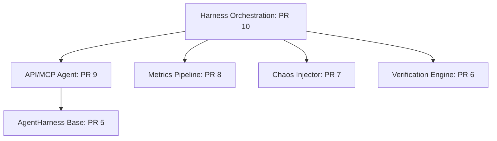

# GKE Labs Stages 2 & 3: Master Code Review Report

This report presents a senior-staff-level combined code review of the 6 open draft pull requests (PRs #5 through #10) in the `devops-bench` repository. 

Using a specialized dual-reviewer multi-agent system, each pull request was concurrently analyzed by an **Architectural & Correctness Reviewer** and a **Quality & Clean Code Reviewer**. This rigorous cross-inspection has uncovered several critical blockers, security risks, performance bottlenecks, and architectural design flaws across the entire Stage 2 and Stage 3 refactoring efforts.

---

## Executive Summary & Stage Migration Verdict

The GKE Labs Stage 2 (Decoupled Agents, Verification, Chaos, and LLM Judge Metrics) and Stage 3 (Evaluation Harness Orchestration) refactoring efforts are highly ambitious, well-modeled, and elegant steps in the right direction. The move towards a unified `AgentHarness` abstraction, type-safe declarative `VerificationSpec` components, a pluggable SRE `ChaosAgent` registry, and an isolated `LLM-as-Judge` metrics pipeline is architecturally sound.

However, the current draft implementations suffer from **several major systemic issues and critical blockers** that make them completely unready for production merge:
1. **Critical Security Vulnerabilities**: Both PR 5 and PR 10 contain high-risk shell injection vulnerabilities in remote execution paths, where prompts and file paths are directly interpolated into single-quoted remote SSH shell strings without any escaping (`-m '{prompt}'` and `cat {session_file}`).
2. **Subprocess Deadlocks**: PR 10 (Evaluation Orchestrator) contains a classic subprocess buffer deadlock where `kubectl port-forward` stdout and stderr are piped but never read. This will freeze evaluating tasks during high-traffic load spikes.
3. **Mismatched Cluster Contexts**: PR 10 contains a dangerous mismatch in environmental defaults between its placeholder substitution and background chaos manager, instructing the agent to work on one deployment while the chaos engine disrupts another.
4. **Severe Performance Bottlenecks**: PR 8 (LLM Judge Metrics) runs evaluations sequentially using Python loops instead of leveraging DeepEval's native parallel batch capabilities, resulting in a latency overhead of $N \times$ (where $N$ is the number of constraints/checklist items).
5. **Runtime Crashes in Async Contexts**: PR 8 uses blocking sync-to-async loop wrappers (`asyncio.run()`), which will immediately crash the entire scoring pipeline when executed inside standard asynchronous agent runtimes.
6. **Dead / Unreachable Code**: PR 6 (Outcome Verification Engine) is blocked by a discrepancy between its recursive dispatcher and its flat Pydantic schema model, rendering its nested evaluation logic completely unreachable and triggering validation failures on complex specs.

---

## Detailed PR Review Findings



### PR 5: `feat(agents): AgentHarness base and CLI agents (Stage 2a)`
> **Verdict**: Providing a model-agnostic, pluggable abstraction framework for evaluation agents is excellent, but the implementation is marred by a critical shell injection vulnerability in the SSH runner, severe code duplication between local and remote runners, sibling imports violating Single Responsibility, and minor bugs in session clearing and parsing.

#### 1. Architecture & API Design
*   **Sibling Imports & Registry Routing Violations** `[major]`
    *   **File & Line**: [gemini.py:L150](file:///Users/pvaradharajan/repos/gke-labs/devops-bench/devops_bench/agents/cli/gemini.py#L150), [gemini.py:L353-356](file:///Users/pvaradharajan/repos/gke-labs/devops-bench/devops_bench/agents/cli/gemini.py#L353-L356)
    *   **Problem**: Sibling imports are used (`from devops_bench.agents.cli.openclaw import ...`). Moreover, the `run_cli_agent` function acts as a dispatcher/router that inspects the binary target path and delegates to OpenClaw or runs generic CLI logic on stdin, bypassing the `AGENTS` registry entirely. This couples the Gemini harness to OpenClaw and generic agent runners, violating sibling isolation and single responsibility.
    *   **Fix**: Remove routing logic and sibling imports from `gemini.py`. Let `GeminiCliAgent` run only Gemini CLI, `OpenClawAgent` run only OpenClaw CLI, and introduce a `GenericCliAgent` for generic binary agents. The factory/pipeline layer should resolve which agent to instantiate from the `AGENTS` registry based on the configuration key.
*   **Raw Dictionary Returns on Public Abstract Interface** `[minor]`
    *   **File & Line**: [base.py:L68-92](file:///Users/pvaradharajan/repos/gke-labs/devops-bench/devops_bench/agents/base.py#L68-L92)
    *   **Problem**: `AgentHarness.run` returns a raw `dict` with required keys listed only in the docstring. This lacks strong typing, makes schema enforcement fragile, and reduces IDE discoverability.
    *   **Fix**: Define a Python `TypedDict` or `dataclass` representing the run result, and use it as the return type hint for `AgentHarness.run`.

#### 2. Testability & Test Quality
*   **Potential TypeError Crash on Null Message Content** `[major]`
    *   **File & Line**: [openclaw.py:L532](file:///Users/pvaradharajan/repos/gke-labs/devops-bench/devops_bench/agents/cli/openclaw.py#L532)
    *   **Problem**: In `_parse_openclaw_session`, the parser extracts message content using `content = msg.get("content", [])`. However, in standard chat payloads, if an assistant message only contains tool calls (and no text), `content` is often set to `None`/`null`. This resolves `content` to `None`, making `for part in content:` raise a `TypeError: 'NoneType' object is not iterable`, crashing the entire evaluation turn.
    *   **Fix**: Safely handle `None` values of `"content"` by falling back to an empty list:
        ```python
        content = msg.get("content") or []
        ```
*   **Greedy Regex Output Parsing** `[minor]`
    *   **File & Line**: [gemini.py:L907](file:///Users/pvaradharajan/repos/gke-labs/devops-bench/devops_bench/agents/cli/gemini.py#L907)
    *   **Problem**: The regex `({.*})` with `re.DOTALL` used in `parse_gemini_cli_output` is highly greedy. If the CLI outputs any log statements containing curly braces `{}` prior to or following the main JSON block (e.g., configuration logs), the regex will span across multiple blocks, making the JSON content invalid and causing `json.loads` to crash.
    *   **Fix**: Update the regex in `gemini.py` to be non-greedy or match from the first occurrence of `{` to the last occurrence of `}`.
*   **Sparse Session Processing Path Verification** `[minor]`
    *   **File & Line**: [test_agents_cli_gemini.py:L936](file:///Users/pvaradharajan/repos/gke-labs/devops-bench/tests/unit/agents/test_agents_cli_gemini.py#L936)
    *   **Problem**: Unit tests for trajectory extraction only verify behavior when directories are completely missing, failing to assert boundary conditions like empty directories, corrupted lines, or duplicate logs.
    *   **Fix**: Add explicit unit tests asserting that `extract_trajectory_from_session` handles malformed or empty session folders gracefully.

#### 3. Code Repetition & Simplification
*   **Severe Local vs. SSH Runner Redundancy** `[major]`
    *   **File & Line**: [openclaw.py:L589](file:///Users/pvaradharajan/repos/gke-labs/devops-bench/devops_bench/agents/cli/openclaw.py#L589), [openclaw.py:L671](file:///Users/pvaradharajan/repos/gke-labs/devops-bench/devops_bench/agents/cli/openclaw.py#L671)
    *   **Problem**: `run_openclaw_agent` and `run_openclaw_agent_local` share more than 100 lines of highly duplicate logic, separately fetching configuration keys, managing timing, stripping ANSI escape codes, and reading files (SSH vs. local).
    *   **Fix**: Refactor and unify the logic by creating two simple helper functions to abstract the environment dependency (SSH vs. local):
        ```python
        def _exec_command(cmd: str | list[str], local: bool, ssh_params: dict | None = None) -> subprocess.CompletedProcess: ...
        def _read_file(path: str, local: bool, ssh_params: dict | None = None) -> str: ...
        ```
*   **Broken Outer Filter Logic in Skill Extractor** `[minor]`
    *   **File & Line**: [gemini.py:L262-269](file:///Users/pvaradharajan/repos/gke-labs/devops-bench/devops_bench/agents/cli/gemini.py#L262-L269)
    *   **Problem**: In `extract_trajectory_from_session`, the outer condition for skill identification is:
        ```python
        if "skills" in file_path or file_path.endswith("SKILL.md"):
            parts = file_path.split("/")
            if "skills" in parts:
        ```
        If a file path ends with `"SKILL.md"` but does not contain `"skills"` in its path (common for custom plugins like `/some/plugin/my-skill/SKILL.md`), `"skills"` will not be in `parts`, failing to extract the skill name.
    *   **Fix**: Support parent folder fallback for custom plugins:
        ```python
        elif file_path.endswith("SKILL.md") and len(parts) >= 2:
            referenced_skills.append(parts[-2])
        ```

#### 4. Correctness & Bugs
*   **CRITICAL: Remote Command Shell Injection Vulnerability** `[blocker]`
    *   **File & Line**: [openclaw.py:L620-626](file:///Users/pvaradharajan/repos/gke-labs/devops-bench/devops_bench/agents/cli/openclaw.py#L620-L626)
    *   **Problem**: The prompt is manually single-quoted directly into the remote SSH shell command: `-m '{prompt}'`. If the prompt contains any single quotes (which is extremely common in benchmark tasks, e.g. `Deploy a 'v1' pod`), it will break the shell quoting, causing a shell syntax error or potential command injection on the remote VM.
    *   **Fix**: Use `shlex.quote(prompt)` to escape the prompt before executing:
        ```python
        f"--agent {shlex.quote(agent_name)} -m {shlex.quote(prompt)}"
        ```
*   **Unsafe Remote Path Interpolation** `[major]`
    *   **File & Line**: [openclaw.py:L652](file:///Users/pvaradharajan/repos/gke-labs/devops-bench/devops_bench/agents/cli/openclaw.py#L652)
    *   **Problem**: The matched `session_file` path from the agent output is directly interpolated into the SSH command: `f"cat {session_file}"`. If the agent's output is manipulated or contains unexpected characters (e.g., spaces or semicolons), this can lead to remote command injection or execution failures when run on the remote VM.
    *   **Fix**: Use `shlex.quote(session_file)` to ensure the path is safely escaped.
*   **OSError Ignored on Subprocess Execution** `[major]`
    *   **File & Line**: [gemini.py:L363-373](file:///Users/pvaradharajan/repos/gke-labs/devops-bench/devops_bench/agents/cli/gemini.py#L363-L373), [openclaw.py:L631-642](file:///Users/pvaradharajan/repos/gke-labs/devops-bench/devops_bench/agents/cli/openclaw.py#L631-L642)
    *   **Problem**: `run_cli_agent` and `run_openclaw_agent` only catch `SubprocessError` from the `core.subprocess.run` call. However, if the specified agent binary target does not exist or `ssh` is not installed on the system, `subprocess.run` raises an `OSError` (such as `FileNotFoundError`), which will bypass the handler and crash the entire evaluation run.
    *   **Fix**: Catch `OSError` as well as `SubprocessError` and return a standard failed harness result dict.
*   **Unescaped Glob Metacharacters in Trajectory ID** `[minor]`
    *   **File & Line**: [gemini.py:L232-237](file:///Users/pvaradharajan/repos/gke-labs/devops-bench/devops_bench/agents/cli/gemini.py#L232-L237)
    *   **Problem**: In `extract_trajectory_from_session`, the `short_id` is directly embedded into glob patterns: `f"session-*-{short_id}.jsonl"`. If `session_id` contains glob metacharacters (such as `*`, `?`, or `[`), it will be interpreted as a wildcard pattern by `glob.glob`, potentially returning unrelated session files or crashing.
    *   **Fix**: Use `glob.escape(short_id)` to ensure that any special glob characters in the ID are treated as literal characters.

#### 5. Code Smells
*   **Hardcoded "operator" Session Clearing in Remote Runner** `[major]`
    *   **File & Line**: [openclaw.py:L622](file:///Users/pvaradharajan/repos/gke-labs/devops-bench/devops_bench/agents/cli/openclaw.py#L622)
    *   **Problem**: In the SSH runner, the session cleanup command is hardcoded to clean the `"operator"` directory: `"rm -rf ~/.openclaw/agents/operator/sessions/*"`. If the SSH runner is called for an agent other than `"operator"` (e.g., `"main"`), it will clear the sessions of `"operator"` but run the agent as `"main"`. Stale trajectory logs from `"main"`'s previous runs are never cleared.
    *   **Fix**: Use the `agent_name` variable dynamically within the cleanup path:
        ```python
        f"rm -rf ~/.openclaw/agents/{shlex.quote(agent_name)}/sessions/*"
        ```
*   **Brittle default environment values** `[major]`
    *   **File & Line**: [openclaw.py:L609](file:///Users/pvaradharajan/repos/gke-labs/devops-bench/devops_bench/agents/cli/openclaw.py#L609), [openclaw.py:L612](file:///Users/pvaradharajan/repos/gke-labs/devops-bench/devops_bench/agents/cli/openclaw.py#L612)
    *   **Problem**: The SSH runner hardcodes specific sandbox defaults: GCP project ID defaults to `"simrankaurk-gke-dev"`, the default VM host points to `"nic0.claw-ubuntu.us-central1-a.c.[project-id].internal.gcpnode.com"`, and SSH user defaults to Google-specific format `f"{current_user}_google_com"`. These settings fail to execute on any environment other than the original author's sandbox.
    *   **Fix**: Raise a descriptive `ValueError` if required config parameters (e.g., `OPENCLAW_VM_HOST`) are missing.

---

### PR 6: `feat(verification): outcome verification engine (Stage 2b)`
> **Verdict**: The outcome verification engine establishes a clean, type-safe verification design using Pydantic. However, it is severely blocked by a critical schema nesting mismatch (where recursive parsing is dead code due to flat types), a runaway loop-execution clamping bug on timeout depletion, unhandled `None` Kubernetes statuses, and a complete lack of dependency injection for the Kubernetes client.

#### 1. Architecture & API Design
*   **Specification Schema vs. Dispatcher Recursion Mismatch** `[major]`
    *   **File & Line**: [spec.py:L249-255](file:///Users/pvaradharajan/repos/gke-labs/devops-bench/devops_bench/verification/spec.py#L249-L255), [runner.py:L161-204](file:///Users/pvaradharajan/repos/gke-labs/devops-bench/devops_bench/verification/runner.py#L161-L204)
    *   **Problem**: The `VerifierAgent` dispatcher class is implemented as a recursive evaluator that can traverse arbitrary nested compound specs. However, the `VerificationSpec` Pydantic root model is defined as:
        ```python
        RootModel[dict[str, SingleVerificationSpec] | list[SingleVerificationSpec] | SingleVerificationSpec]
        ```
        Because `SingleVerificationSpec` represents only flat, concrete verifiers and is not recursive, Pydantic validation will reject any nested specification structure. Therefore, the dispatcher's recursive code is unreachable, and nesting specs triggers a `ValidationError`.
    *   **Fix**: Enable recursive models in Pydantic using forward references and `model_rebuild()`:
        ```python
        RecursiveSpec = Union[Dict[str, "RecursiveSpec"], List["RecursiveSpec"], SingleVerificationSpec]
        class VerificationSpec(RootModel[RecursiveSpec]): pass
        VerificationSpec.model_rebuild()
        ```
*   **Tight Coupling of Concrete Verifiers to Imports** `[major]`
    *   **File & Line**: [spec.py:L238-246](file:///Users/pvaradharajan/repos/gke-labs/devops-bench/devops_bench/verification/spec.py#L238-L246)
    *   **Problem**: The specification engine statically links all concrete verifier implementations using a hardcoded Union type. This violates the Open-Closed Principle. Any new verifier (e.g., `ServiceIPVerifier`) requires modifying core engine files (`spec.py`) to import and add it to the union.
    *   **Fix**: Implement a `VerifierRegistry` and use Pydantic's `BeforeValidator` to resolve types dynamically.
*   **Lack of Cluster Context Dependency Injection** `[minor]`
    *   **File & Line**: [pod_healthy.py:L324](file:///Users/pvaradharajan/repos/gke-labs/devops-bench/devops_bench/verification/verifiers/pod_healthy.py#L324), [scaling_complete.py:L440](file:///Users/pvaradharajan/repos/gke-labs/devops-bench/devops_bench/verification/verifiers/scaling_complete.py#L440)
    *   **Problem**: Concrete verifiers do not accept a target `kubeconfig` attribute, forcing them to always rely on the global default Kubernetes context. This prevents executing verifications against multi-cluster setups.
    *   **Fix**: Add an optional `kubeconfig: str | None = None` attribute to `BaseVerifier` and forward it to Kubernetes CLI wrappers.

#### 2. Testability & Test Quality
*   **Lack of Kubernetes Wrapper Dependency Injection in Verifiers** `[major]`
    *   **File & Line**: [pod_healthy.py:L315-316](file:///Users/pvaradharajan/repos/gke-labs/devops-bench/devops_bench/verification/verifiers/pod_healthy.py#L315-L316), [scaling_complete.py:L431-432](file:///Users/pvaradharajan/repos/gke-labs/devops-bench/devops_bench/verification/verifiers/scaling_complete.py#L431-L432)
    *   **Problem**: Concrete verifiers are tightly coupled to globally imported Kubernetes CLI wrapper functions (`get_json`, `wait`, `poll_until`). This forces unit tests to perform fragile module-level mock patching.
    *   **Fix**: Update the `BaseVerifier.verify` method interface to accept an optional Kubernetes client or wrapper dependency.
*   **Uncovered Error & Exception Branches** `[minor]`
    *   **File & Line**: `tests/unit/verification/` test files
    *   **Problem**: Critical error handling catch blocks (such as API exceptions inside `_get_pods_details()` or ValueError on invalid JSON inside `_check_scaling()`) are completely unexercised by unit tests.
    *   **Fix**: Add targeted unit tests asserting that these methods handle exceptions gracefully.

#### 3. Correctness & Bugs
*   **Runaway Loop Execution on Timeout Budget Exhaustion** `[major]`
    *   **File & Line**: [runner.py:L208-212](file:///Users/pvaradharajan/repos/gke-labs/devops-bench/devops_bench/verification/runner.py#L208-L212)
    *   **Problem**: The remaining-budget utility `_remaining` clamps the remaining timeout to a minimum of 1 second: `return max(1, timeout_sec - int(elapsed))`. When evaluating a sequence list of verifiers, if a preceding verifier consumes the entire timeout budget, `_remaining` will still return `1`. Consequently, the dispatcher will continue executing remaining checks even though the overall timeout has expired, violating the budget contract and causing runaway loops.
    *   **Fix**: Allow `_remaining` to return `0` or negative values. In the list/dict evaluation loops of `wait_for_condition`, check if the remaining budget is `<= 0` and abort early.
*   **Catastrophic AttributeError Crash on Unpopulated API Statuses** `[major]`
    *   **File & Line**: [pod_healthy.py:L401-403](file:///Users/pvaradharajan/repos/gke-labs/devops-bench/devops_bench/verification/verifiers/pod_healthy.py#L401-L403), [scaling_complete.py:L515](file:///Users/pvaradharajan/repos/gke-labs/devops-bench/devops_bench/verification/verifiers/scaling_complete.py#L515)
    *   **Problem**: The verifiers fetch `status` and immediately chain `.get()` or dictionary accesses: `p.get("status", {}).get("phase")`. If a resource is in a transient state and its status is unpopulated (Kubernetes API returns `"status": null`, parsed as `None` in Python), `get("status", {})` returns `None` (since the key exists). Attempting to call `.get()` on `None` raises a catastrophic `AttributeError`.
    *   **Fix**: Safely unpack and default the status dictionary to handle explicit `null` statuses:
        ```python
        status = p.get("status") or {}
        phase = status.get("phase")
        ```
*   **Loss of Timeout Precision and Off-by-One Accumulation** `[minor]`
    *   **File & Line**: [runner.py:L139](file:///Users/pvaradharajan/repos/gke-labs/devops-bench/devops_bench/verification/runner.py#L139), [base.py:L91](file:///Users/pvaradharajan/repos/gke-labs/devops-bench/devops_bench/verification/base.py#L91)
    *   **Problem**: The dispatcher and base verifier specify `timeout_sec: int` and use `int(elapsed)` to track the remaining budget, despite the underlying standard k8s functions natively supporting floats, leading to precision loss.
    *   **Fix**: Change all `timeout_sec` signatures from `int` to `float`.

---

### PR 7: `feat(chaos): chaos injector with Trigger/Fault registries (Stage 2c)`
> **Verdict**: PR 7 represents a beautiful modular restructuring of the legacy chaos engine using GKE-native Fault and Trigger concepts with registry-based extensibility. However, it is blocked by severe circular dependencies between core files and plugins, hardcoded traffic ports rendering SRE actions inflexible, unhandled exceptions on malformed LLM tool call arguments, and premature active-event signaling.

#### 1. Architecture & API Design
*   **Layering Violation & Circular Dependency (Direct Core-to-Plugin Coupling)** `[major]`
    *   **File & Line**: [agent.py:L64](file:///Users/pvaradharajan/repos/gke-labs/devops-bench/devops_bench/chaos/agent.py#L64), [agent.py:L208-210](file:///Users/pvaradharajan/repos/gke-labs/devops-bench/devops_bench/chaos/agent.py#L208-L210)
    *   **Problem**: `ChaosAgent` (the core agent orchestrator in `agent.py`) directly imports and references `run_chaos_command` from `devops_bench.chaos.faults.generate_load`. This violates layered architecture design because a core orchestration class should never have compile-time knowledge of concrete plugins. Additionally, this introduces a circular dependency since `generate_load.py` imports `ChaosAgent` from `agent.py`.
    *   **Fix**: Use dependency injection. Define a protocol or a callable signature for tool execution handlers, and pass the tools and their respective handlers to `ChaosAgent` upon initialization.
*   **Open-Closed Principle Violation (Hardcoded Prompt & Tools)** `[major]`
    *   **File & Line**: [agent.py:L72-118](file:///Users/pvaradharajan/repos/gke-labs/devops-bench/devops_bench/chaos/agent.py#L72-L118)
    *   **Problem**: The `SYSTEM_INSTRUCTION` and `RUN_COMMAND_TOOL` are hardcoded directly within `agent.py`. This prevents `ChaosAgent` from being reused for other faults (such as pod-killing or node-scaling faults) without editing the core orchestrator.
    *   **Fix**: Allow passing `system_instruction` and `tools` as arguments to the constructor.

#### 2. Testability & Test Quality
*   **Over-specified Test Masking a Hardcoded Prompt/Target Port Bug** `[major]`
    *   **File & Line**: [test_chaos_generate_load.py:L725-774](file:///Users/pvaradharajan/repos/gke-labs/devops-bench/tests/unit/chaos/test_chaos_generate_load.py#L725-L774)
    *   **Problem**: The integration-level test `test_inject_runs_agent_and_signals_event` initializes a chaos task `spec` targeting `"http://localhost:8082"`, yet configures its mocked LLM client to return a command targeting `"http://localhost:8080"`. Because the mock expects exactly what the hardcoded prompt asks for, it passes successfully, masking a design flaw: the user's `service_url` input is completely ignored and overridden by hardcoded instructions inside `SYSTEM_INSTRUCTION` and `goal(...)`.
    *   **Fix**: Parameterize the LLM prompts so they dynamically consume the `service_url` target supplied in the `spec`. Update the unit test's mocked LLM command and assertions to target `"http://localhost:8082"`.

#### 3. Correctness & Bugs
*   **Lost Model Content on Turn Limit Exceeded (Loop Truncation Bug)** `[major]`
    *   **File & Line**: [agent.py:L178-181](file:///Users/pvaradharajan/repos/gke-labs/devops-bench/devops_bench/chaos/agent.py#L178-L181), [agent.py:L193-196](file:///Users/pvaradharajan/repos/gke-labs/devops-bench/devops_bench/chaos/agent.py#L193-L196)
    *   **Problem**: In `_run_async`, `final_text` is initialized to `""` and only updated to the current turn's text if `not function_calls`. If the LLM generates a tool call on its very last turn (turn 8, reaching the loop cap), `final_text` remains empty (`""`) or holds a stale value. Any analysis or final thoughts generated alongside that last tool call are completely discarded.
    *   **Fix**: Update `final_text` with the model's text response on *every* turn, ensuring that the latest available generation is always returned:
        ```python
        final_text = text
        if not function_calls:
            _log.info("chaos agent finished: no further tool calls")
            break
        ```
*   **Empty Command Shell Execution Vulnerability** `[minor]`
    *   **File & Line**: [generate_load.py:L425-427](file:///Users/pvaradharajan/repos/gke-labs/devops-bench/devops_bench/chaos/faults/generate_load.py#L425-L427)
    *   **Problem**: If the LLM returns an empty command or whitespace-only command string, `shlex.split(command)` produces an empty list `[]`. Passing `argv = []` to the core subprocess runner wrapper results in a low-level `IndexError` in python's subprocess library, returning cryptic Python tracebacks directly to the LLM.
    *   **Fix**: Insert a clean guard clause in `run_chaos_command` to immediately handle empty command inputs before spawning:
        ```python
        if not command.strip():
            return "Error: command string is empty"
        ```

#### 4. Code Smells
*   **Hardcoded Target Service Port/URL Makes SRE Agent Brittle** `[major]`
    *   **File & Line**: [agent.py:L94-95](file:///Users/pvaradharajan/repos/gke-labs/devops-bench/devops_bench/chaos/agent.py#L94-L95), [generate_load.py:L475-478](file:///Users/pvaradharajan/repos/gke-labs/devops-bench/devops_bench/chaos/faults/generate_load.py#L475-L478)
    *   **Problem**: The SRE `SYSTEM_INSTRUCTION` and the planned-mode `goal(...)` prompt templates hardcode GKE port-forwarded traffic targets to `"http://localhost:8080"`. This makes it impossible for the agent to target alternative ports or configure multiple parallel traffic targets as requested by the caller via the JSON spec.
    *   **Fix**: Remove the hardcoded `"http://localhost:8080"` string from the general prompts. Instead, parse the target service URL from the incoming `spec` and inject it dynamically into the prompts.
*   **Unhandled Exceptions on Malformed LLM Tool Arguments** `[minor]`
    *   **File & Line**: [agent.py:L183-212](file:///Users/pvaradharajan/repos/gke-labs/devops-bench/devops_bench/chaos/agent.py#L183-L212)
    *   **Problem**: In `_run_async`, the loop fetches model tool-call args and runs: `self._execute_tool(call.get("name"), call.get("args") or {})`. If a model returns a malformed function call where `args` is a string or list instead of a parsed dict, `args.get("command", "")` will throw an unhandled `AttributeError` and crash the loop.
    *   **Fix**: Add argument-type validation at the entry-point of `_execute_tool`.
*   **Prematurely setting chaos_active_event** `[minor]`
    *   **File & Line**: [generate_load.py:L416-418](file:///Users/pvaradharajan/repos/gke-labs/devops-bench/devops_bench/chaos/faults/generate_load.py#L416-L418)
    *   **Problem**: `chaos_active_event.set()` is triggered immediately when a `_LOAD_MARKER` is detected, *before* parsing, expanding, or attempting to run the command. If the subsequent execution fails, the harness is still signaled that a load spike is active and will proceed to take corrupt benchmark measurements.
    *   **Fix**: Validate the command first, and only trigger the event immediately before running the subprocess command.

---

### PR 8: `feat(metrics): LLM-as-judge metrics pipeline (Stage 2d)`
> **Verdict**: The modular, lazy-imported metrics pipeline represents a major decoupling achievement for LLM scoring. However, it is blocked by severe performance bottlenecks from sequential deepeval calls, an `asyncio.run` loop-blocking call that will crash in any async environment, duplicate documentation constraints that mathematically break Grounding scoring, and packaging path bugs breaking non-dev environments.

#### 1. Architecture & API Design
*   **Severe Performance Bottleneck from Sequential deepeval.evaluate Calls** `[major]`
    *   **File & Line**: [pipeline.py:L761-768](file:///Users/pvaradharajan/repos/gke-labs/devops-bench/devops_bench/metrics/pipeline.py#L761-L768), [grounding.py:L428-444](file:///Users/pvaradharajan/repos/gke-labs/devops-bench/devops_bench/metrics/grounding.py#L428-L444)
    *   **Problem**: In both the dynamic checklist evaluation loop and the documentation grounding loop, the code calls `evaluate([test_case], metrics=[m])` individually for each metric inside a loop. Since `deepeval` is fully capable of running multiple metrics in parallel, executing them one-by-one sequentially completely destroys evaluation throughput and results in a severe latency bottleneck (taking $N\times$ longer).
    *   **Fix**: Refactor the sequential loops to pass the entire list of metrics directly to `evaluate()`. For example:
        ```python
        result = evaluate([all_test_case], metrics=dynamic_metrics)
        ```

#### 2. Testability & Test Quality
*   **Brittle/Over-specified Mocks of evaluate()** `[major]`
    *   **File & Line**: `tests/unit/metrics/test_metrics_grounding.py:1188-1194`, `tests/unit/metrics/test_metrics_pipeline.py:1347-1352`
    *   **Problem**: These tests assert on the sequential execution order of `evaluate` calls by patching `evaluate` with `side_effect` lists. If we modify the implementation to evaluate all metrics in a single concurrent batch call (which is the correct optimization for performance), these tests will break.
    *   **Fix**: Redesign the mocks to return the evaluation results regardless of the sequence of calls (asserting on final state).
*   **Integration Testing Disguised as Unit Tests** `[minor]`
    *   **File & Line**: [test_metrics_skills.py:L1472-1487](file:///Users/pvaradharajan/repos/gke-labs/devops-bench/tests/unit/metrics/test_metrics_skills.py#L1472-L1487)
    *   **Problem**: The unit tests access the local filesystem and verify the actual contents of the `.md` files in `skills/`. This introduces a dependency on external, non-test repo state in unit tests. If the file structure or wording in the skill files changes, these tests will fail.
    *   **Fix**: Mock the file reading or mock `Path.read_text` / `Path.is_file` in these unit tests.

#### 3. Correctness & Bugs
*   **CRITICAL: Runtime Loop Blocking and Crashes with asyncio.run** `[blocker]`
    *   **File & Line**: [geval.py:L289](file:///Users/pvaradharajan/repos/gke-labs/devops-bench/devops_bench/metrics/geval.py#L289)
    *   **Problem**: The synchronous `generate()` wrapper calls `asyncio.run(self.a_generate(prompt))`. In Python, calling `asyncio.run()` when an event loop is already running in the current thread raises a `RuntimeError: asyncio.run() cannot be called from a running event loop`. Because most benchmark runs and agent architectures are run within an async context, this wrapper will immediately crash the entire scoring pipeline.
    *   **Fix**: Implement a robust synchronous execution strategy that detects if an event loop is already running, delegating execution to a separate thread pool executor when necessary.
*   **Duplicate Constraints Break Grounding Scoring** `[major]`
    *   **File & Line**: [grounding.py:L403-421](file:///Users/pvaradharajan/repos/gke-labs/devops-bench/devops_bench/metrics/grounding.py#L403-L421)
    *   **Problem**: `total_constraints` is defined as `len(doc_metrics)`. If duplicate constraints are present across different documentation guides, `doc_metrics` will contain duplicate elements. However, `doc_constraints_map` uses the constraint text as a key, effectively deduplicating them. When calculating `applied_constraints`, the value can never exceed the number of *unique* constraints. As a result, `applied_constraints` will always be less than `total_constraints` even if every constraint is perfectly met, making a perfect `5.0` grounding score mathematically impossible!
    *   **Fix**: Deduplicate the constraints *prior* to creating the metrics list.
*   **Inconsistent [GEval] Suffix Stripping Bloats Score Keys** `[major]`
    *   **File & Line**: [pipeline.py:L751](file:///Users/pvaradharajan/repos/gke-labs/devops-bench/devops_bench/metrics/pipeline.py#L751), [pipeline.py:L755](file:///Users/pvaradharajan/repos/gke-labs/devops-bench/devops_bench/metrics/pipeline.py#L755)
    *   **Problem**: `deepeval` automatically appends the string ` [GEval]` to the name of its metrics under `metrics_data`. While `_record_metrics` includes a `strip_geval` option, the pipeline explicitly disables it (`strip_geval=False`) for `OutcomeValidity` and `ToolInvocation` metrics. Consequently, the score dictionary keys are populated as `"OutcomeValidity [GEval]"`, violating the expected schema and breaking downstream modules.
    *   **Fix**: Remove the `strip_geval` parameter entirely and unconditionally strip the suffix in `_record_metrics`.
*   **Bullet-Stripping Bug Alters Requirement Text** `[minor]`
    *   **File & Line**: [pipeline.py:L636](file:///Users/pvaradharajan/repos/gke-labs/devops-bench/devops_bench/metrics/pipeline.py#L636)
    *   **Problem**: The checklist extractor uses `line.strip("- ")` to parse the requirement line. This strips both leading *and* trailing hyphens and spaces. If a requirement naturally ends in a hyphen (e.g., `- Set namespace suffix to staging-`), the trailing hyphen is erroneously stripped (`"Set namespace suffix to staging"`), corrupting the criteria text evaluated by the LLM.
    *   **Fix**: Strip only the leading bullet symbols and then strip any surrounding whitespaces:
        ```python
        raw_checklist_items = [line.lstrip("- ").strip() for line in reqs_section.split("\n") if line.strip().startswith("-")]
        ```

#### 4. Code Smells
*   **CRITICAL: Brittle Repository Root Resolution (_REPO_ROOT) Breaks Packaged Installations** `[blocker]`
    *   **File & Line**: [outcome_validity.py:L523](file:///Users/pvaradharajan/repos/gke-labs/devops-bench/devops_bench/metrics/outcome_validity.py#L523), [tool_invocation.py:L847](file:///Users/pvaradharajan/repos/gke-labs/devops-bench/devops_bench/metrics/tool_invocation.py#L847)
    *   **Problem**: Both modules resolve the repository root using `Path(__file__).resolve().parents[2]` and look for files inside `_REPO_ROOT / "skills"`. This hardcoded relative parent traversal only works when executing code within a git clone development environment. If `devops-bench` is installed as a package (e.g., via `pip install .`), `parents[2]` will point to the `site-packages` directory, where the `skills/` folder does not exist, crashing with a `FileNotFoundError`.
    *   **Fix**: Pack the `skills/` directory as package data (e.g. within `devops_bench/skills/`) and load them using Python's standard `importlib.resources` package.
*   **Crashing on Missing or None URL in Grounding Calculations** `[major]`
    *   **File & Line**: [grounding.py:L368-369](file:///Users/pvaradharajan/repos/gke-labs/devops-bench/devops_bench/metrics/grounding.py#L368-L369)
    *   **Problem**: In `calculate_doc_retrieval_rate`, the keys `"doc_name"` and `"url"` are accessed with direct subscription (`doc["url"]`) and `.lower()` is called unconditionally. If `url` is missing or is `None` (common for offline/local guides), this raises a `KeyError` or `AttributeError`.
    *   **Fix**: Use `.get()` safely and verify that the value is not `None` before calling `.lower()`.

---

### PR 9: `feat(agents): API/MCP loop agent (Stage 2e)`
> **Verdict**: PR 9 introduces a solid modular agent loop for API/MCP agents, but is severely blocked by blocking synchronous file and glob I/O inside async functions (stalling the event loop), a subprocess argument parsing bug that fails execution of multi-word commands, and unhandled exceptions on uninitialized clients.

#### 1. Architecture & API Design
*   **Blocking Synchronous I/O Calls inside Async Function** `[major]`
    *   **File & Line**: [loop.py:L192-193](file:///Users/pvaradharajan/repos/gke-labs/devops-bench/devops_bench/agents/api/loop.py#L192-L193)
    *   **Problem**: The async function `process_query` performs synchronous, blocking file reads: `with open(file_path) as f: result_text = f.read()`. In asynchronous Python (asyncio), calling blocking I/O functions on the event loop blocks the entire thread, preventing other concurrent operations from executing.
    *   **Fix**: Offload the blocking I/O operation to a worker thread using `asyncio.to_thread`.
*   **Blocking Filesystem Glob and exists Calls inside Async Loop** `[minor]`
    *   **File & Line**: [loop.py:L394-412](file:///Users/pvaradharajan/repos/gke-labs/devops-bench/devops_bench/agents/api/loop.py#L394-L412)
    *   **Problem**: Inside the async function `run_api_agent`, synchronous blocking filesystem functions like `os.path.exists`, `glob.glob` (with recursion), and `parse_skill_md` are called directly on the main event loop. Recursively globbing directories can block the asyncio event loop on large filesystems.
    *   **Fix**: Offload these operations to a worker thread using `asyncio.to_thread` or perform the skills loading synchronously during agent initialization.

#### 2. Testability & Test Quality
*   **Untested Core Context Manager Connection Loop** `[major]`
    *   **File & Line**: `tests/unit/agents/api/test_agents_api_mcp.py`
    *   **Problem**: The successful execution paths of the `MCPClient.__aenter__` and `__aexit__` context management methods are completely untested. Only the exception path (when the `mcp` library is missing) is covered.
    *   **Fix**: Implement a comprehensive unit test that mocks `StdioServerParameters`, `stdio_client`, and `ClientSession` to ensure happy path connections work.

#### 3. Correctness & Bugs
*   **CRITICAL: Subprocess Command and Arguments Parsing Bug** `[blocker]`
    *   **File & Line**: [mcp.py:L553](file:///Users/pvaradharajan/repos/gke-labs/devops-bench/devops_bench/agents/api/mcp.py#L553)
    *   **Problem**: `server_params = StdioServerParameters(command=self.server_path)` passes the entire command string (e.g. `"uv run mcp-server"`) directly as `command`. Since stdio transport spawns a subprocess without running in a shell, executing a command string with spaces directly will crash with a `FileNotFoundError` because it tries to find an executable literally named `"uv run mcp-server"`.
    *   **Fix**: Import `shlex` and parse `self.server_path` to separate the base command from its arguments:
        ```python
        import shlex
        parts = shlex.split(self.server_path)
        server_params = StdioServerParameters(command=parts[0], args=parts[1:])
        ```
*   **Truncated Tool Result Text Extraction** `[major]`
    *   **File & Line**: [loop.py:L198-204](file:///Users/pvaradharajan/repos/gke-labs/devops-bench/devops_bench/agents/api/loop.py#L198-L204)
    *   **Problem**: When extracting tool results, `process_query` only inspects the first content block (`tool_result.content[0]`). If a tool returns multiple content blocks (e.g. multiple text responses, or text + images), subsequent content blocks are discarded.
    *   **Fix**: Loop through and aggregate all text content blocks returned by the tool.

#### 4. Code Smells
*   **Sloppy None Handling during Tool Resolution** `[major]`
    *   **File & Line**: [loop.py:L197](file:///Users/pvaradharajan/repos/gke-labs/devops-bench/devops_bench/agents/api/loop.py#L197)
    *   **Problem**: Inside `process_query`, if `mcp_client` is `None` (for example, when `bench_use_mcp` is set to `False` but the model mistakenly requests a tool), the code executes `tool_result = await mcp_client.call_tool(name, args)`. This immediately triggers `AttributeError: 'NoneType' object has no attribute 'call_tool'`. Relying on a catch-all exception block to handle a predictable `None` reference is a bad code smell and prints misleading stack traces.
    *   **Fix**: Add an explicit check at the top of the tool resolution block:
        ```python
        if mcp_client is None:
            result_text = "Error: MCP client is not initialized. No tools are available."
        ```

---

### PR 10: `feat(harness): evaluation orchestrator (Stage 3a)`
> **Verdict**: The staging of stage 3a provides a clean orchestrator pipeline but is severely blocked by a classic subprocess pipe buffer deadlock during port-forwards, resource leaks of processes and background threads on task exceptions, and a dangerous mismatch in default namespaces and deployments that targets chaos at one resource while instructing the agent to work on another.

#### 1. Architecture & API Design
*   **Eager Imports in Scenario Manager Defeat Lazy Import Design** `[minor]`
    *   **File & Line**: [scenario.py:L31-33](file:///Users/pvaradharajan/repos/gke-labs/devops-bench/devops_bench/harness/scenario.py#L31-L33)
    *   **Problem**: `ScenarioManager` eagerly imports `ChaosAgent` and `VerifierAgent` at the top level. Since `DefaultHarness` eagerly imports `ScenarioManager`, any startup import of the harness module will eagerly import these agents and their underlying heavy dependencies (langchain, SDKs), violating lazy loading goals.
    *   **Fix**: Import `ChaosAgent` and `VerifierAgent` lazily inside the methods where they are initialized (e.g., inside `ScenarioManager.__init__`).

#### 2. Testability & Test Quality
*   **Tight Coupling and Lack of Dependency Injection in ScenarioManager** `[major]`
    *   **File & Line**: [scenario.py:L674-676](file:///Users/pvaradharajan/repos/gke-labs/devops-bench/devops_bench/harness/scenario.py#L674-L676)
    *   **Problem**: `ScenarioManager.__init__` directly instantiates concrete `ChaosAgent` and `VerifierAgent` classes. This tightly couples the orchestrator to those implementations, necessitating brittle module-level patching in tests.
    *   **Fix**: Use dependency injection by accepting optional `chaos_agent` and `verifier_agent` parameters in `ScenarioManager.__init__`.
*   **Failed Benchmark Tasks Are Dropped Silently from Output** `[major]`
    *   **File & Line**: [default.py:L446-449](file:///Users/pvaradharajan/repos/gke-labs/devops-bench/devops_bench/harness/default.py#L446-L449)
    *   **Problem**: If a task execution raises an exception during provisioning, chaos injection, or agent execution inside `_run_one`, the error is caught and logged, but `_run_one` returns `None`. The task is then entirely omitted from `results.json`. This hides failures from automated parses.
    *   **Fix**: Modify `_run_one` to return a result dictionary even on failure, populated with status `"failed"`, the associated error message, and a score of 0.

#### 3. Correctness & Bugs
*   **CRITICAL: Deadlock Hazard: Popen stdout/stderr Pipes Are Never Read** `[blocker]`
    *   **File & Line**: [scenario.py:L790-794](file:///Users/pvaradharajan/repos/gke-labs/devops-bench/devops_bench/harness/scenario.py#L790-L794)
    *   **Problem**: `ScenarioManager` starts `kubectl port-forward` using `subprocess.Popen` with `stdout=subprocess.PIPE` and `stderr=subprocess.PIPE`. However, these pipes are never read. Once the OS pipe buffers fill up (typically 64KB, filled rapidly by repetitive connection logs during load spikes), the `kubectl` process will block indefinitely, causing the port-forward and the load test to hang.
    *   **Fix**: Use `subprocess.DEVNULL` instead of `subprocess.PIPE` for `stdout` and `stderr` to safely discard process output without buffer blockages.
*   **CRITICAL: Environmental defaults are mismatched between modules** `[blocker]`
    *   **File & Line**: [default.py:L346-347](file:///Users/pvaradharajan/repos/gke-labs/devops-bench/devops_bench/harness/default.py#L346-L347) vs [default.py:L381-385](file:///Users/pvaradharajan/repos/gke-labs/devops-bench/devops_bench/harness/default.py#L381-L385)
    *   **Problem**: If environmental configurations are missing, `replace_placeholders` and `start_scenario` resolve the critical variables `TARGET_DEPLOYMENT_NAME` and `NAMESPACE` to completely different default values. `replace_placeholders` defaults them to `"hello-app"` and `"production"`, while `start_scenario` defaults them to `"hypercomputer-d1-frontend"` and `"default"`. This means the agent's instructions (prompts) will target one deployment while the background chaos engine disrupts another.
    *   **Fix**: Consolidate default values into shared class-level constants.
*   **Inadequate Scenario Join Timeout (Timing / Mismatch Bug)** `[major]`
    *   **File & Line**: [default.py:L264](file:///Users/pvaradharajan/repos/gke-labs/devops-bench/devops_bench/harness/default.py#L264)
    *   **Problem**: `_SCENARIO_JOIN_SEC` is set to `90` seconds, but the background verification timeout (`_VERIFICATION_TIMEOUT_SEC`) is set to `120` seconds. If the verification takes longer than 90 seconds (e.g., under slow recovery), `scenario_thread.join` in `_drain_scenario` will time out, causing the harness to read incomplete reports and immediately trigger cluster teardown while the verifier thread is still executing.
    *   **Fix**: Set `_SCENARIO_JOIN_SEC` to a value comfortably greater than `_VERIFICATION_TIMEOUT_SEC` (e.g., 180 seconds).
*   **Resource Leak of Background Processes on Early Exceptions** `[major]`
    *   **File & Line**: [default.py:L487-535](file:///Users/pvaradharajan/repos/gke-labs/devops-bench/devops_bench/harness/default.py#L487-L535), [scenario.py:L790-817](file:///Users/pvaradharajan/repos/gke-labs/devops-bench/devops_bench/harness/scenario.py#L790-L817)
    *   **Problem**: If `_run_one` encounters any exception during agent execution (e.g. rate limits, API failures), the `try` block is aborted, bypassing `_drain_scenario`. The loop goes directly to `finally` and tears down the cluster. However, the background daemon thread and its child processes (`kubectl port-forward` and `fortio`) are NOT stopped, leading to runaway background execution.
    *   **Fix**: Introduce a `stop` method in `ScenarioManager` that terminates the port-forward process and sets an abort event. Call it in `_run_one`'s `finally` block.

#### 4. Code Smells
*   **Missing Sanity Check on Port-Forward Process** `[minor]`
    *   **File & Line**: [scenario.py:L797-800](file:///Users/pvaradharajan/repos/gke-labs/devops-bench/devops_bench/harness/scenario.py#L797-L800)
    *   **Problem**: After starting the `kubectl port-forward` process, the code sleeps for `3` seconds and then proceeds blindly to invoke the chaos agent. If `kubectl` failed immediately (e.g. due to incorrect credentials, wrong namespace, or deployment absence), `self.pf_process` is terminated, but the code does not check its status. This results in cryptic connection errors inside the chaos agent instead of a clear setup error.
    *   **Fix**: Perform a poll check on the spawned process after the settle sleep.

---

## Actionable Integration Checklist for Team

To successfully merge Stage 2 and 3 into the main repository branch, the following priority sequence must be followed:

### Phase 1: Security & Correctness Blockers (Priority 1)
- [ ] **PR 5**: Wrap `agent_name` and `prompt` in `shlex.quote` in `openclaw.py` (line 620-626 and 652).
- [ ] **PR 10**: Consolidate `TARGET_DEPLOYMENT_NAME` and `NAMESPACE` defaults into a single class-level configuration class shared between placeholders and orchestrator runs.
- [ ] **PR 10**: Swap `subprocess.PIPE` for `subprocess.DEVNULL` in `kubectl port-forward` Popen call to avoid deadlock.
- [ ] **PR 9**: Parse standard input command strings with `shlex.split` inside `mcp.py` to prevent "No such file or directory" crashes on multi-word commands.
- [ ] **PR 8**: Check for running loops inside synchronous `generate` wrappers in `geval.py` and execute inside a thread pool if a loop is already running.

### Phase 2: Performance & Architectural Soundness (Priority 2)
- [ ] **PR 8**: Refactor sequential `deepeval.evaluate` loops in `pipeline.py` and `grounding.py` to batch evaluate metrics in parallel.
- [ ] **PR 8**: Deduplicate grounding constraints *prior* to metric creation to prevent mathematically broken scores.
- [ ] **PR 6**: Rebuild Pydantic Models recursively in `spec.py` to match the dispatcher recursion engine.
- [ ] **PR 7**: Resolve core-to-plugin circular dependencies in chaos by injecting callable execution handlers.
- [ ] **PR 9**: Offload blocking file I/O operations (`with open` and recursive globs) inside async loop functions to worker threads via `asyncio.to_thread`.
