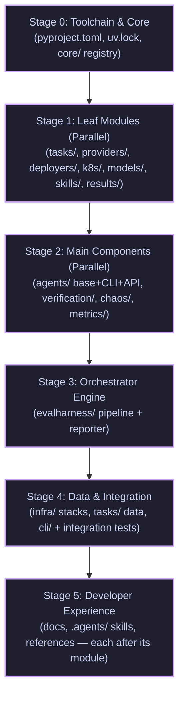

# Migration: PR execution plan

### Documentation directory map
- For the high-level migration runbook for gke-labs maintainers, see [README.md](./README.md).

This document maps out the phased execution strategy to migrate `devops-bench` from `gke-labs/devops-bench` (the *incubator*) to `kubernetes-sigs/devops-bench` (the *canonical* home) as small, reviewable Pull Requests.

---

## 1. Core PR execution principles

To ensure a smooth, error-free upstream review process, every PR must adhere to these structural constraints:

1. **Co-locate Implementation and Unit Tests**: Each module or package must migrate together with its corresponding unit tests under `tests/unit/` in a single PR.
2. **Prioritize Interfaces and Registries**: Basic classes, registries, and Abstract Base Classes (ABCs) must land before the concrete implementations that import them to ensure clean dependency trees.
3. **Keep the Frontier Documented**: Immediately after an upstream PR merges, uncomment its paths in `migrated.bara.sky` in a small, reviewed `gke-labs` PR (refer to [README.md](./README.md) §4 Step 2.2 for details). This locks the paths and activates the back-sync bot.
4. **All PRs are Disposable**: If a forward PR becomes stale, close it and re-assemble a clean one using `prep-export.sh`.
5. **No Cross-Border Imports**: Banish imports of un-migrated paths in migrated code to maintain a clean boundary.
6. **Smallest reviewable unit**: Prefer the finest PR that still builds and tests green. Once a shared base/registry has landed, migrate **one concrete per PR** — one CLI agent, one verifier, one fault, one deployer engine, one model provider, one task — rather than a whole family at once. This keeps upstream reviews fast and isolates any back-sync issue to a single concrete. The stage groupings in §2 are logical buckets; each typically expands into several granular PRs (enumerated in §3.2).
7. **Dependencies travel with their code**: `pyproject.toml`/`uv.lock` are `NEVER_SYNC` (managed per-repo), so a package can't be staged upstream ahead of its code. A PR that introduces a new third-party import must add that package to `pyproject.toml` and refresh `uv.lock` **in the same PR** (the `migration-prep` skill does this). `core/` is pure-stdlib and adds none.

---

## 2. Phased PR sequence

The migration is divided into 6 chronological stages. Stage 0 is the prerequisite for all subsequent steps. Within Stages 1 and 2, modules can migrate largely in parallel. Stage 5 (docs + skills) trails the code — each doc/skill ships only after the module it describes has fully landed.

> [!NOTE]
> This section is a **coarse logical sketch**. The **per-PR breakdown — with exact paths, owners, and the dependency-derived wave each PR ships in — is [§3.2](#32-prs-by-wave)**.

---

### Stage 0: Toolchain and foundation
The unblocker — nothing migrates until the toolchain and CI exist upstream.

- **0a. Toolchain & CI**: build system (Hatchling), `ruff`, and the `guardrails.yml` checks.
- **0b. Foundation (`core/`)**: domain-agnostic helpers and types imported by every higher layer.

---

### Stage 1: Leaf modules
Depend only on `core/` (and `deployers/` also on `providers/`): `tasks/` contracts, `providers/`, `deployers/`, `k8s/` wrappers (event watches deferred), `models/` clients, `skills/` judge guides, and the `results/` model.

> [!TIP]
> Send the smallest leaf first (e.g., `tasks/`) to verify your whole toolchain, fork PR mechanics, CNCF EasyCLA, and the first `migrated.bara.sky` flip + back-sync run with minimal risk.

---

### Stage 2: Main components
Built on the leaves: `agents/` (base + CLI + API), `verification/` (needs `k8s/`), `chaos/` (needs `models/`; **replaces upstream `agents/chaos/`**), and the `metrics/` judge (each family migrates with its `skills/` guide).

---

### Stage 3: Orchestrator engine
`evalharness/` ties the `ScenarioManager` (chaos + verification) to the `DefaultEvalHarness` (task loop, provisioning, execution, teardown); its `reporter.py` consumes `results/`.

---

### Stage 4: Data and entrypoints
`tf/` → `infra/` (modules + stacks), the benchmark `tasks/` data, and the entrypoints (`cli.py`, `__main__.py`, `run.py`) plus integration tests.

---

### Stage 5: Developer experience
Docs, `.agents/` skills + references, and `AGENTS.md` routers ship after the code — each gated on the module it documents; the per-unit breakdown and owners are in [§3.4](#34-documentation-and-skills). gke-labs-only tooling (the `migration-prep` skill, `docs/migration/`, and the leaderboard assets) never migrates and retires with `gke-labs`.

---

## 3. Splitting CLs across the team

This section assigns the PRs above to owners so work proceeds in parallel without stepping on each other. We split by **lane** (a coherent column of related modules) rather than by stage, so each person's PRs share context, and the dependency order in §2 still governs *when* each lands.

### 3.1 Per-owner, once before your first forward PR

Every owner completes the [README.md](./README.md) §2 prerequisites independently:

1. Sign the **CNCF EasyCLA**, with `git config user.email` matching the CLA identity (back-sync preserves authorship, so an unsigned author blocks the sync PR — see README §2.3).
2. Fork `kubernetes-sigs/devops-bench` and wire the three remotes (`gkelabs`, `upstream`, `origin`) per README §4 Step 2.1.
3. (Pradeep, one-time) provision `SYNC_BOT_TOKEN` for the back-sync bot (README §2.3); the rest of the toolkit is already installed (README §6).

### 3.2 PRs by wave

Every PR carries a **wave number**. **All PRs in a wave are mutually independent and ship in parallel**; a wave opens only once *every* PR in the prior wave is merged upstream **and flipped** in `migrated.bara.sky` (so later PRs can import them via the back-sync). The waves are **derived from the real import edges in `devops_bench/`** (verified against the tree), so nothing in a wave imports anything else in the same wave. Load is balanced at **8–9 PRs per owner**. Waves **1–2** are the unavoidable serial bootstrap (toolchain, then `core/`, imported everywhere); **3–5** are the parallel bulk; **6–8** are the serial orchestrator tail + entrypoints.

| Wave | PR | Paths | Imports (basis) | Owner |
|:--:|---|---|---|---|
| **1** | toolchain & CI | reconcile the *base* `pyproject.toml`/`uv.lock`/`.python-version` + `hack/boilerplate.py`; add `guardrails.yml`; preserve upstream `OWNERS`/`SECURITY*`/governance (no code deletion). Runtime deps travel per-PR (§1.7). | — | **Pradeep** |
| **2** | foundation `core/` | `core/*` (registry, context, results, logging, subprocess, errors, config, run_env) | toolchain | **Pradeep** |
| **3** | `tasks/` contracts | `tasks/schema.py`, `tasks/loader.py` | core | **Jessie** |
| **3** | `skills/` guides | `skills/` (packaged `*.md` guides) | — | **Jessie** |
| **3** | metrics base | `metrics/base.py` (METRICS registry) | core | **Jessie** |
| **3** | models base | `models/base.py`, `models/utils/loop.py` (`run_tool_loop`) | core | **Richard** |
| **3** | agents base | `agents/base.py`, `config.py`, `result.py`, `capabilities/*` | core | **Simran** |
| **3** | `k8s/` wrappers | `k8s/kubectl.py`, `k8s/conditions.py` | core | **Eugene** |
| **3** | `providers/` | `providers/base.py`, `providers/gcp.py`, `providers/kind.py` | core | **Eugene** |
| **3** | Terraform modules | `tf/modules/` *(no code deps — only needs to precede stacks in wave 4)* | — | **Eugene** |
| **3** | `results/` model | `results/row.py`, `aggregate.py`, `normalize.py` | core | **Pradeep** |
| **4** | models: gemini client | `models/gemini.py` | models base | **Richard** |
| **4** | models: claude client | `models/claude.py` | models base | **Richard** |
| **4** | models: ollama client | `models/ollama.py` | models base | **Richard** |
| **4** | **gemini CLI agent** | `agents/cli/gemini_cli/` (agent, parsing) | agents base | **Richard** |
| **4** | MCP client | `agents/api/mcp.py` | core | **Richard** |
| **4** | **openclaw CLI agent** | `agents/cli/openclaw/` (agent, parsing) | agents base | **Simran** |
| **4** | agents shared | `agents/shared/cli_capabilities.py`, `shared/skills.py` | agents base | **Simran** |
| **4** | chaos base **(replaces upstream `agents/chaos/`)** | adds `chaos/base.py`, `agent.py`, `schema.py`, `spec.py`; **`git rm` the 3 superseded `agents/chaos/` files** | core, models base | **Simran** |
| **4** | verification base | `verification/base.py`, `spec.py`, `runner.py` | core, k8s | **Jessie** |
| **4** | metrics judge | `metrics/geval.py`, `pipeline.py`, `_skills.py` | core, models base, skills, metrics base | **Jessie** |
| **4** | deployers base | `deployers/base.py`, `factory.py` | core, providers | **Eugene** |
| **4** | Terraform stacks | `tf/prebuilt/` → `infra/stacks/` (split per stack if large) | tf modules | **Eugene** |
| **4** | `evalharness/reporter` | `evalharness/reporter.py` | core, results | **Simran** |
| **5** | deployers: tofu engine | `deployers/tofu.py` | deployers base | **Eugene** |
| **5** | deployers: noop engine | `deployers/noop.py` | deployers base | **Eugene** |
| **5** | API agent | `agents/api/agent.py`, `api/skills.py` | agents base, models, mcp | **Richard** |
| **5** | chaos: generate-load fault | `chaos/faults/generate_load.py` | chaos base, k8s | **Simran** |
| **5** | chaos: time-delay trigger | `chaos/triggers/time_delay.py` | chaos base | **Simran** |
| **5** | verification: pod-healthy | `verification/verifiers/pod_healthy.py` | verification base | **Jessie** |
| **5** | verification: scaling-complete | `verification/verifiers/scaling_complete.py` | verification base | **Jessie** |
| **5** | metric: grounding | `metrics/grounding.py` | metrics judge | **Pradeep** |
| **5** | metric: tool-invocation | `metrics/tool_invocation.py` | metrics judge | **Pradeep** |
| **5** | metric: checklist | `metrics/checklist.py` | metrics judge | **Pradeep** |
| **5** | metric: outcome-validity | `metrics/outcome_validity.py` | metrics judge | **Jessie** |
| **5** | metric: chaos-metrics | `metrics/chaos_metrics.py` | metrics judge | **Jessie** |
| **5** | task data (batch 1) | a slice of `tasks/<group>/<task>/` (YAML + co-located infra) | tasks contracts, stacks | **Eugene** |
| **5** | task data (batch 2) | a slice of `tasks/…` | tasks contracts, stacks | **Richard** |
| **5** | task data (batch 3) | a slice of `tasks/…` | tasks contracts, stacks | **Pradeep** |
| **6** | harness base + scenario | `evalharness/base.py`, `artifacts.py`, `scenario.py` | agents, chaos, verification, deployers | **Simran** |
| **7** | default eval harness | `evalharness/default.py` | harness base, metrics, results, tasks | **Simran** |
| **8** | CLI entrypoint | `cli.py`, `__main__.py`, `run.py` | evalharness, metrics, tasks | **Pradeep** |
| **8** | integration tests | `tests/integration/` | everything | **Pradeep** |

> [!NOTE]
> The **Imports (basis)** column is the verified dependency that fixes each PR's wave: a PR sits in the earliest wave after *all* its imports.

### 3.3 Coordination

Keep these guidelines in mind when exporting:

- **Frontier flips:** review/merge the `suggest-flips` PRs promptly after each upstream merge. A wave can't open until its prerequisites are flipped.
- **Back-sync health:** watch `backsync.yml` for healthiness and merge PRs from it immediately to ensure repos stay in sync.
- **Weekly status:** run `hack/migration-status.sh` and post the Migrated/Remaining frontier so owners know which imports are safe.
- **Disposable PRs:** if a forward PR goes stale behind a flip, the owner closes it and re-cuts with `prep-export.sh`.

### 3.4 Documentation and skills

Docs, `.agents/` skills, and shared references sit *on top of* the code, so each ships **only once the module it documents has fully landed upstream and flipped** — a doc must never describe an un-migrated path. They carry no import edges, so they are gated by "documents X", not by a wave's import basis. Each skill's `.agents/skills/<name>/` content travels with its `.claude/skills/<name>` symlink.

| Wave | Unit | Paths | Gated on (module fully landed) | Owner |
|:--:|---|---|---|---|
| **6** | infra docs | `docs/components/infra.md` | providers + deployers + infra stacks | **Eugene** |
| **6** | models docs | `docs/components/model_providers.md`, `docs/how-to/add-a-model-provider.md` | models | **Richard** |
| **6** | agents docs | `docs/components/agents.md`, `docs/how-to/add-an-agent-harness.md`, `.agents/references/harness-capabilities.md` | agents (base + CLI + API + shared) | **Simran** |
| **6** | metrics docs | `docs/components/metrics.md` | metrics (base + judge + families) | **Jessie** |
| **6** | tasks docs | `docs/how-to/add-a-task.md`, `tasks/AGENTS.md` | tasks contracts + task data | **Eugene** |
| **6** | review skills | `.agents/skills/task-review/`, `.agents/skills/devops-bench-review/`, `.agents/references/permission-configs/review-readonly.*` | tasks + review targets (tasks, docs conventions) | **Jessie** |
| **6** | cleanup skill | `.agents/skills/cleanup-orphaned-resources/` | providers + deployers + infra | **Eugene** |
| **9** | eval-run skills + refs | `.agents/skills/{run-eval,run-parallel-evals,validate-eval,diagnose-eval-failure}/`, `.agents/references/{running-evals,monitoring-and-recovery,unlimited-mode}.md`, `.agents/references/permission-configs/{eval-infra.*,README.md}` | `cli/` + default eval harness | **Pradeep** |
| **9** | run + onboarding docs | `docs/how-to/run-evals.md`, `docs/components/bastion.md`, `docs/getting-started.md` | `cli/` + evalharness + infra | **Pradeep** |
| **9** | repo overview + routers + docs-sync skill | `docs/README.md`, `docs/components/architecture.md`, `docs/components/glossary.md`, `docs/contributing.md`, `docs/appendix/known_issues.md`, `AGENTS.md`, `CLAUDE.md`, `devops_bench/AGENTS.md`, `.agents/skills/docs-sync/` | everything (ships last) | **Pradeep** |

> [!NOTE]
> **Never migrated (retires with `gke-labs`):** the `migration-prep` skill and `docs/migration/**` (they exist only to run this migration), plus the leaderboard assets — `site/**`, `site_new/**` (incl. `site_new/AGENTS.md`) and `docs/how-to/leaderboard.md`. These are kept out of the frontier and marked `NEVER_SYNC`.
